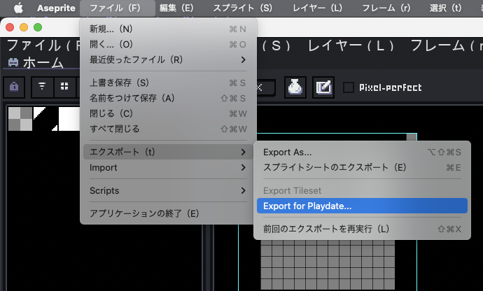
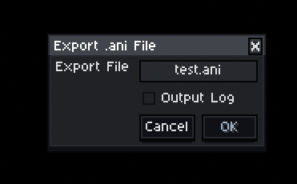

# Aseprite Player for Playdate

[Japanese](README_ja.md)

This library allows data created with Aseprite to be played back with Playdate.

## Install extension for Aseprite

```
cd aseprite_extention
rake pack
```

After executing the above, you will get a file `playdate-ani-exporter-{version-number}.aseprite_extention`, which you can double-click to install into Aseprite.

## Output from Aseprite

1. Open the `.aseprite` file.


2. Select `Export for Playdate` as it has been added to the export menu.



3. In the dialog, select the destination and output log, and press `OK` to save the file.



4. Pass the saved `{save name}.ani` and `{save name}.png` to the project.


## samples

### setup

Be sure to do the following first.

```
cd sample
rake generate:resource
```

### execute each sample

```
cd sample/simple_file
rake generate:simulator:debug
rake build:simulator:debug
rake run:debug
```

#### Xcodeで実行

```
cd sample/simple_file
rake generate:xcode
```

Open and run the generated .xcodeproject.

