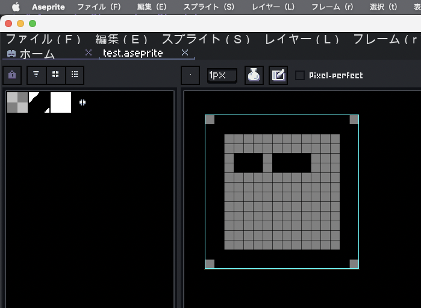
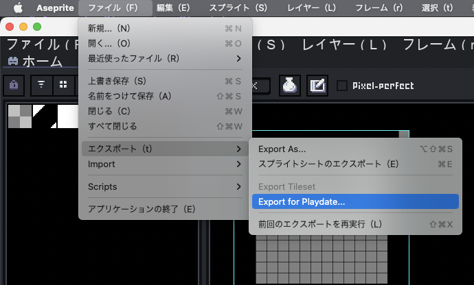
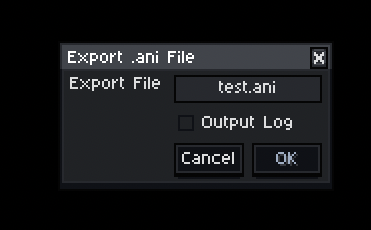
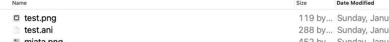

# Aseprite Player for Playdate

Asepriteで作成したデータをPlaydateで再生できるライブラリです。


## Aseprite用拡張のインストール

```
cd aseprite_extention
rake pack
```

上記を実行すると、`playdate-ani-exporter-{バージョン番号}.aseprite_extention`と言うファイルができるので、それをダブルクリックしてAsepriteにインストールします。

## Asepriteからの出力

1. `.aseprite`ファイルを開きます



2. エクスポートメニューに`Export for Playdate`が追加されているので選択します



3. ダイアログで、保存先や出力ログの有無を選択し、`OK`を押して保存します



4. 保存された`{保存名}.ani`と`{保存名}.png`をプロジェクトに渡します




## サンプル

### setup

最初に必ず以下を実行してください。

```
cd sample
rake setup
```

### 各サンプルを実行してみる

#### コマンドラインで実行

```
cd sample/simple_file
rake generate:simulator:debug
rake build:simulator:debug
rake run:debug
```

#### Xcodeで実行

```
cd sample/simple_file
rake generate:xcode
```

生成される.xcodeprojectを開いて実行します。

